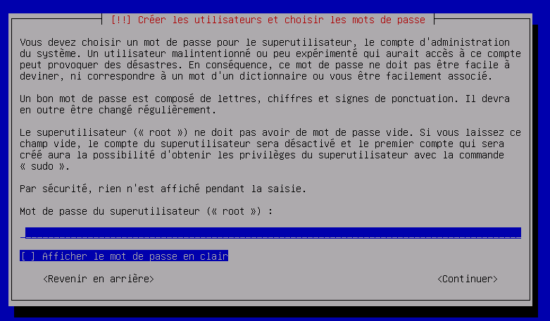
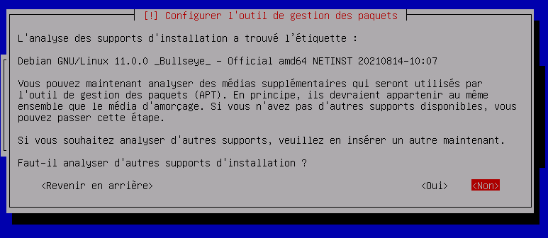

# **Mise en place d'une VM (Machine Virtuel)**

### **Qu'est ce qu'une VM :**

Une **machine virtuelle** ou **VM** est un environnement entièrement virtualisé qui fonctionne sur une machine physique. Elle exécute son propre système d’exploitation (OS) et bénéficie des mêmes équipement qu’une machine physique : CPU, mémoire RAM, disque dur et carte réseau. Plusieurs machines virtuelles avec des OS différents peuvent coexister sur le même serveur physique : Linux, MacOS, Windows…

---

## **L'installation**

-Pour la mise en place de la VM, nous allons utiliser VMWare :

- Qui ce presente ainsi :

Nous allons premièrement créer une nouvelle machine avec l'ISO suivant qui est Debian 11 sous Linux.

Ici pour télécharger l'ISO -> https://lecrabeinfo.net/telecharger/debian-11-x64

Une fois tout cela installé, il faudra lancer la machine virtuel et suivre les étapes une par une.

## **Etape n°1**

- Donner un nom a votre machine 

## **Etape n°2**

- le domaine sera vide, appuyer sur continuer

## **Etape n°3**

- Il faudra créer un mot de passe pour la machine et répéter cette démarche 2 fois

## **Etape n°4**

- Choississer le premier de l'image ci-dessous

## **Etape n°5**

- Appui sur entrer

## **Etape n°6**

- Choisit "Terminer le partitionnement et appliquer les changements"

## **Etape n°7 et 8**

- Il faudra choisir "OUI" pour les 2 

## **Etape n°9**

- Il faudra choisir "deb.debian.org" donc celui qui est surligner 

## **Etape n°10**

- le mandataire HHTP sera vide, appuyer sur continuer

## **Etape n°11**
- Il faudra dire "non" à cette étape 

## **Etape n°12**

- Une étape importante, puisqu'il faudra décocher les 2 premiers logiciels en **appuyant sur la barre "espace"** puis appuyer sur entrer.

## **Etape n°13**

- Choisir "oui" puis appuyer sur entrer

## **Etape n°14**

- Choisir "/dev/sda" puis appuyer sur entrer

## **Etape finale**
- Installation finit !!!

---
---

# **Mise en place d'une clé SSH**

1- Pour la mise en place de la clé SSH, il faudra ce rendre dans notre VM que l'on a créer précédamment :

- La VM allumer, vous aurez une console où il vous demandera votre identifiant et votre mot de passe

- Il faudra ce rendre à la **racine** de la console pour pouvoir installer les composants pour la clé SSH, en fesant "**su**" puis inscrire votre mot de passe 

- On peut voir sur notre image en rouge qu nous sommes bien à la racine "**root**".

2- Nous pouvons mainteant installer les composants nécessaires :
- ge

