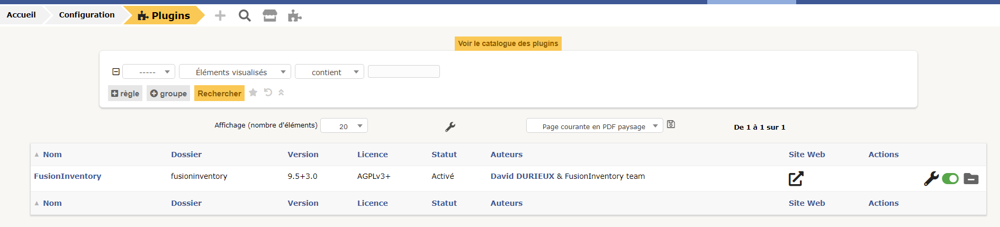

# **Ajouter un plugin pour pouvoir réaliser l’inventaire du parc**

## **1 - Le plugin Fusion Inventory**
---


</br>

### **Qu'est ce que Fusion Inventory ?** 
**FusionInventory** est un logiciel servant à l'inventaire et la maintenance d'un parc informatique à l'aide d'autres logiciels de ce type tels que GLPI ou OCS Inventory. Il permet notamment d'effectuer : l'inventaire matériel & logiciel ; le Wake-on-lan ; le déploiement de logiciels. 

</br>

---
## **2 - Installation de Fusion Inventory en ligne de commande**
---
Pour l'installation de Fusion Inventory, il faudra ce rendre dans votre machine Virtuel (Debian 11 sous Linux). 

Les commandes à entrer sont les suivantes : 
- Premièrement il faut mettre à jour son système avec : 
```
apt-get update && apt-get upgrade
```
</br>

- Puis téléchargez le plugin Fusion Inventory avec ces commandes :

```
cd /usr/src

wget https://github.com/fusioninventory/fusioninventory-for-glpi/releases/download/glpi9.5%2B3.0/fusioninventory-9.5+3.0.tar.bz2

tar xfvj fusioninventory-9.5+3.0.tar.bz2 -C /var/www/html/glpi/plugins

```

- Ensuite il faut attribuer les droits d'accès au serveur web : 

```
chown -R www-data /var/www/html/glpi/plugins
```
</br>

---
## **3 - Installation de Fusion Inventory sur le web**
---

Pour l'installation de Fusion Inventory sur le web, il faut retourner sur GLPI et se connectez à votre compte.

- Une fois connectez, rendez vous dans la rubrique suivante : Configuration > Plugins :


- On pourra constater que Fusion Inventory est bien installé

- Appuyez sur le bouton activer et votre Fusion Inventory est près pour l'utilisation :



- Fusion Inventory ce trouve ici : **Administration > FusionInventory** :


</br>

---
## **4 - Régler le problème de crontab**
---

Sur votre page Fusion Inventory on peut distinguer le message d'erreur qui est crontab. Nous allons donc régler ce problème. 

Rendez-vous sur votre VM dans la ligne de commande, entrez la commande suivante : 

```
crontab -u www-data -e
```

- Vous allez choisir **le choix 1**. 
- Vous aurez un fichier qui s'ouvre il faudra ajouter cette ligne à la fin : 

```
*/1 * * * * /usr/bin/php5 /var/www/html/glpi/front/cron.php &>/dev/null
```

- Finalement on relancera Cron : 

```
/etc/init.d/cron restart
```

- Ensuite il faudra ce rendre sur GLPI (sur le web) et allez dans : **Configuration > Actions Automatiques**

- Dans la liste, allez a la page 2 et cherchez pour **TaskScheduler** : 


- Appuyez sur **TaskScheduler** puis cliquer sur **Exécuter** :


- Retournez dans : **Administration > FusionInventory** et le message d’erreur en jaune aura disparu !