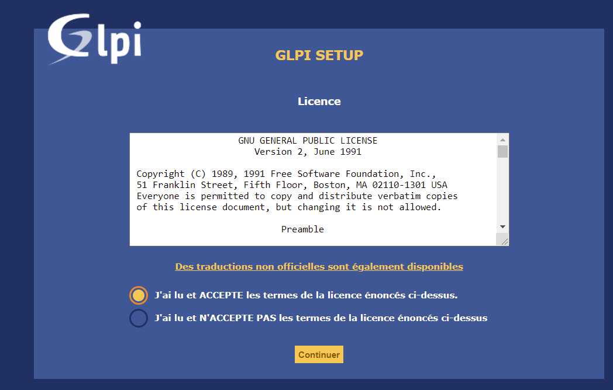
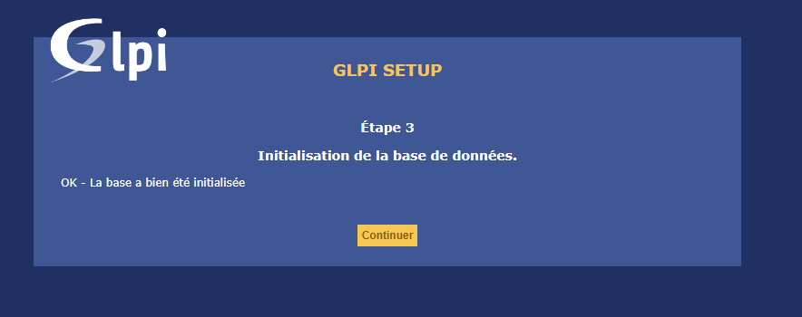

# **Configurer un outil de gestion de ticket**

## 1 -Installer et configurer GLPI 
---

### **Qu'est ce que GLPI ?**


**GLPI** est un logiciel libre de gestion des services informatiques et de gestion des services d'assistance. Il a été conçu pour gérer tous les problèmes de gestion d’actifs, de la gestion des composants matériels et des inventaires logiciels à la gestion du helpdesk utilisateur.


### **L'installation des pré-requis sur notre machine** : 

-Tout d'abord nous devons installer des pré-requis avant de passer à l'installation de GLPI :

<br/>

-> Installation d'apache 2 
```
apt-get install apache2 php libapache2-mod-php
```
<br/>

-> Installation de PHP (modules PHP requis par Apache et GLPI)
```
apt-get install php-imap php-intl php-ldap php-curl php-xmlrpc php-gd php-mysql php-cas
```

<br/>

-> Installation de Mariadb
```
apt-get install mariadb-server
```
```
mysql_secure_installation
```
Répondez "y" à toutes les questions. Quand à la partie mot de passe, ne l'oubliez pas il va nous servire à entrer dans notre compte mariabd.

<br/>

-> Installation de modules complémentaires
```
apt-get install apcupsd php-apcu
```

<br/>

-> Redémarage d'apache 
```
sudo service apache2 restart
```

<br/>

-> Creation de la base de données qui nous permettra ensuite d’installer GLPI :

```
mysql -u root -p
```

Ici nous créons:  
- une base de données nommée glpi

- un compte utilisateur MySQL nommé glpi

- et donnons le contrôle total sur la base de données glpi à l’utilisateur glpi

```
MariaDB [(none)]> CREATE DATABASE glpi CHARACTER SET UTF8 COLLATE UTF8_BIN;
MariaDB [(none)]> CREATE USER 'glpi'@'%' IDENTIFIED BY 'glpi';
MariaDB [(none)]> GRANT ALL PRIVILEGES ON glpi.* TO 'glpi'@'%';
MariaDB [(none)]> FLUSH PRIVILEGES;
MariaDB [(none)]> quit;
```
<br/>

### **L'installation de GLPI en ligne de commande** :
<br/>

Voici les commandes que j'ai utilisé pour installer GLPI en ligne de commande  :
<br/>

- J'ai récuperer les paquets GLPI avec les commandes suivante :
```
cd /usr/src/

wget https://github.com/glpi-project/glpi/releases/download/9.5.6/glpi-9.5.6.tgz

tar xfvj fusioninventory-9.5+3.0.tar.bz2 -C /var/www/html/glpi/plugins
```

- Nous devons aussi attribuer les droits au serveur d'agir sur les fichiers avec la commande ci-dessous :
```
chown -R www-data /var/www/html/glpi/
```
<br/>

### **L'installation de GLPI sur le web** :

<br/>

Une fois l'installation de GLPI en ligne de commande accomplie, il faudra ouvrir votre navigateur de recherche, en entrant votre adresse IP, suivie de /glpi .

- Voici le mien -> http://192.168.47.138/glpi

<br/>

Si votre installation a bien été accomplie vous aurez cette page qui s'affichera : 
- Choissisez votre langue puis appuyer sur "OK" 


- Acceptez les conditions générales et appuyer sur "continuer"  :



- Appuyer sur installer : 


- Ici nous devons vérifier que tout les paquets ont bien installés, si ils sont bien installés appuyer sur "continuer" : 


- Précedemment nous avons créée une base de données avec MariaDB, il faut donc asssocier les infos (utilisateurs, mot de passe) mit dans la base de données sur GLPI.
- Ici il faudra mettre :

>Serveur -> localhost

>utilisateur -> glpi

>mot de passe -> glpi
- Appuyer sur "continuer" :


- La page ci-dessous il faut choisir la base données en "**glpidb**" :
- cliquer une seule fois sur "**continuer**" sinon il peut y avoir des problèmes tel que la base de données ne ce créer pas ou que la page devient blanche.


- La base de données à bien été synchronisée avec le serveur GLPI ! Appuyer sur "**continuer**" :



- Les étapes 4 et 5 il faudra juste appuyer sur "**continuer**".

<br/>

- L'installation de GLPI est un succèss et est terminé ! 
- Il vous donne aussi des identifiants et mot de passe par défaut.


- Une fois que vous avez cliquer sur "**Utiliser GLPI**", vous avez désormais accès à la page de connexion du serveur où il faudra rentrer son identifiant et mot de passe :


