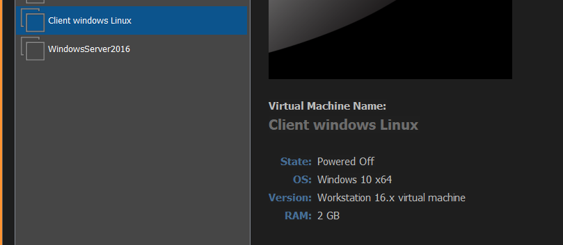
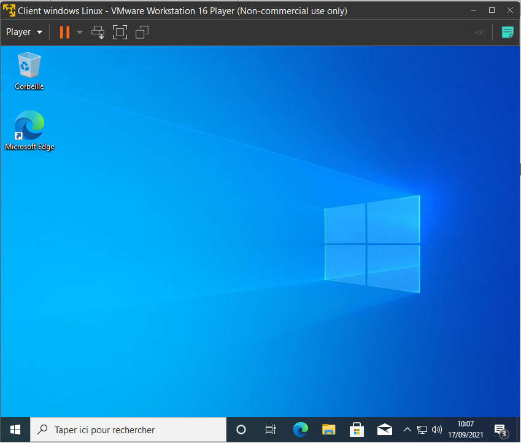
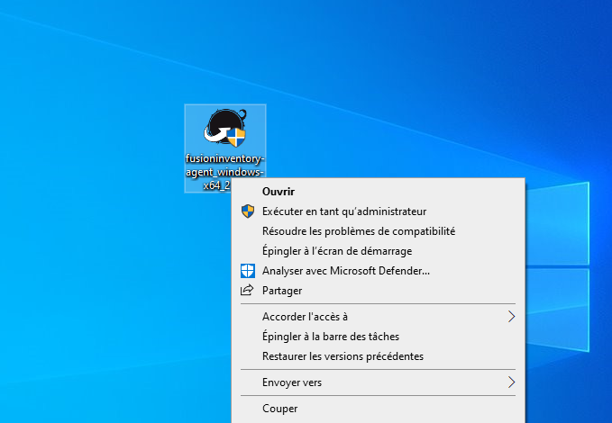
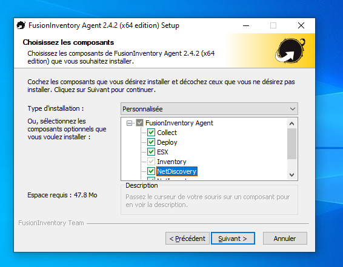
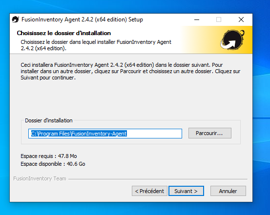
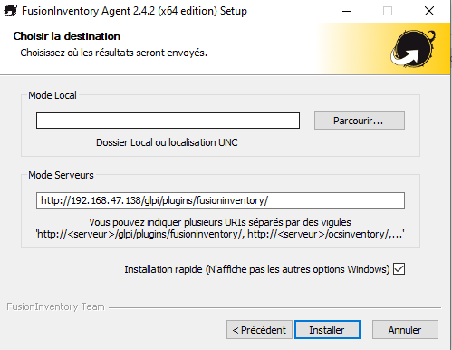
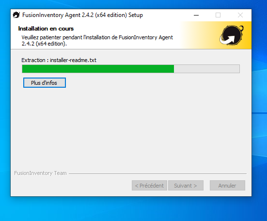
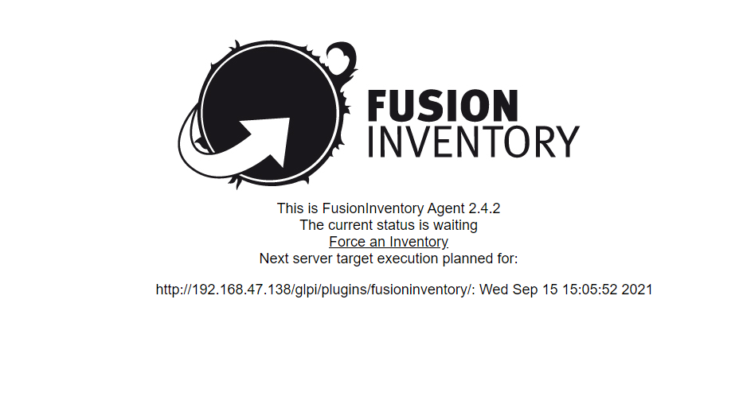
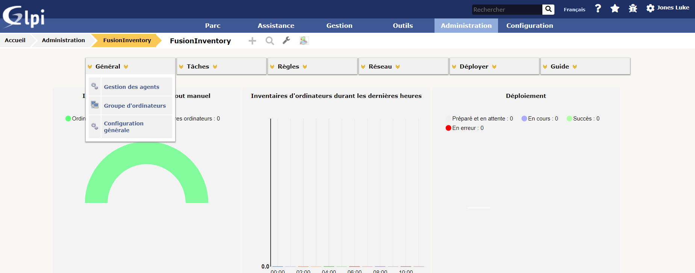
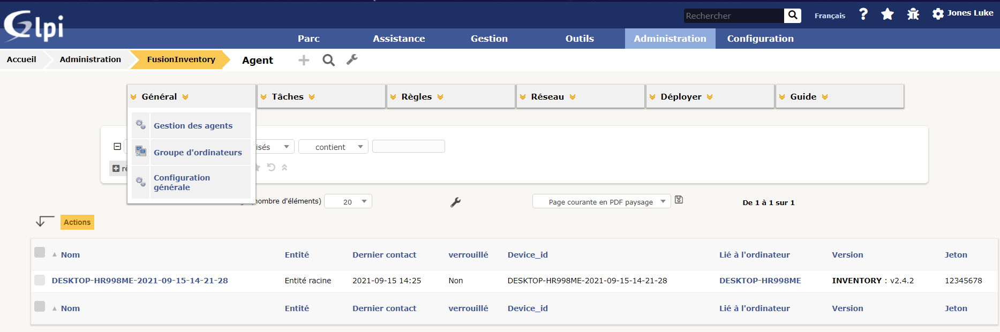

# **Mettre en place un poste client Windows 10 et remonter le poste client dans l’inventaire GLPI**

## 1 - Mise en place du poste windows sur une machine virtuel  
---
Pour la creation de votre poste windows vous allez vous rendre sur VMWare et créer une nouvelle machine.
- Sur le web il faudra chercher pour un ISO windows client 
- Sur votre VM voici à quoi ressemble le windows : 

- Après avoir cliquez sur votre machine Windows, suivez les étapes d'installation qui sont relativement simple.
- Installation terminer de votre windows, vous aurez la page suivante qui s'affiche : 

---
## 2- Installation et configuration du Fusion Inventory agent 
---

 

Sur votre VM windows client, vous devriez donc téléchargez l'agent voici le le lien -> https://github.com/fusioninventory/fusioninventory-agent/releases/download/2.4.2/fusioninventory-agent_windows-x64_2.4.2.exe

- Une fois le téléchargement terminé, lancer le téléchargement en tant qu'Admisnistrateur comme l'image ci-dessous : 

- Premièrement vous allez devoir choisir la langue, ensuite vous serez sur l'écran de bienvenue où il faudra cliquer sur "**suivant**" 

 

- La troisième page est la page qui vous propose le choix des outils, nous allons donc tout les cochers : 

- Cliquez sur "**suivant**" pour la page 4 : 

- Notre agent Fusion va faire son inventaire, ici nous devons choisir où envoyer ses résultats. Nous allons donc envoyer ses résultats à notre serveur. Changer l'adresse IP par la vôtre :

Le mien -> http://192.168.47.138/glpi/plugins/fusioninventory/

- Voila l'installation est terminé !

---
## 3- Verification de l'installation de Fusion Inventory et GLPI
---

 

Nous allons vérifier que le plugin Fusion (l'agent) c'est bien syncroniser avec GLPI.

- Tapez dans votre navigateur web de votre VM windows, l’adresse suivante -> http://localhost:62354 

- Si l'agent c'est correctement installé, cette page devrait apparaitre :

- Vérifier que toutes les informations sont les bonnes. Si tout est bon cliquez sur "**Force an Inventory**"

 
---

Retournons dans l’interface web de notre serveur GLPI pour bien distinguer la présence de l’agent.

- Cliquez sur **Administration > FusionInventory**: 

- Puis, dans le sous-menu, sur **Général > Gestion des Agents** :

- Ici c'est la liste des agents remontés dans FusionInventory. On voit bien que notre agent est bien présent. 

